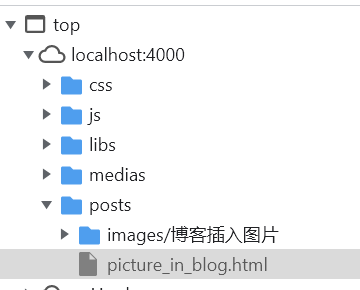

博客的图片始终让人头疼，有时候神奇的成功了，有时候又神奇的不成功

<!--more-->

最为无脑的方式，一定是图片路径选择```\images\```路径，但博客图片多起来之后会非常乱。因此，将 _config.yml 文件中修改```post_asset_folder```，使得使用```hexo new "{name}"```新建博客文章时，也会在`_post`目录下自动生成`[name]`文件夹。

```shell
post_asset_folder: true
```

这样，理论上来说，只需要在博客中使用``````即可上传图片。但是实际操作时，在本地Markdown文件都是可以显示，但是上传到博客之后却无法显示。


可以看到，在资源这里，包含图片的文件夹压根就没有上传上来



略微测试了下，猜测有以下原因：

- 标题用的中文，生成的文件夹自然是中文，可能对中文不兼容
- 因此，我习惯性将文件夹和abbrlink对应，这样导致```{post.name}```和文件夹不同名而不会上传

因此，我新建了一个博客`images`，之后所有路径都放置在`images\{postname}\`下


## 文件隐藏

接下来其实想把images博客隐藏掉，但是不能让他不上传，否则文件夹会一起不上传，导致又无法显示
