<!--more-->

# 加密网络流量检测、分类与 识别研究现状

## 加密流量研究背景与意义

- 网络流量的加密化必然趋势
  - 国内外网络安全法律法规的完善
  - 用户网络安全意识的兴起
  - 用户隐私保护的需要
  - 数字信息的版权保护
  - 网络游戏的反作弊
- 复杂新型网络协议的广泛应用
  - 新型加密协议：
    - 公开协议：TLS-1.3、QUIC、DTLS、DoT
    - 半公开协议/私有协议：MMTLS、Vmess、Shadowsocks
  - 新型应用协议：
    - 公开协议：HTTP-2.0、Skype
    - 私有应用协议：Facebook、WhatsApp、抖音/Tiktok、Twitter、Telegram、Netflix、支付宝、微博
- 网络呈现高速大流量化特征

## 研究分类方法与新研究体系结构

- 加密流量检测：从网络流量中筛选出加密流量的过程
- 加密流量分类：对加密流量实际搭 载的广义应用进行分类的过程
- 加密流量识别：对流量负载所传输的内容或对该流量对应的用户行为 、用户QoE状况等元数据进行识别的过程

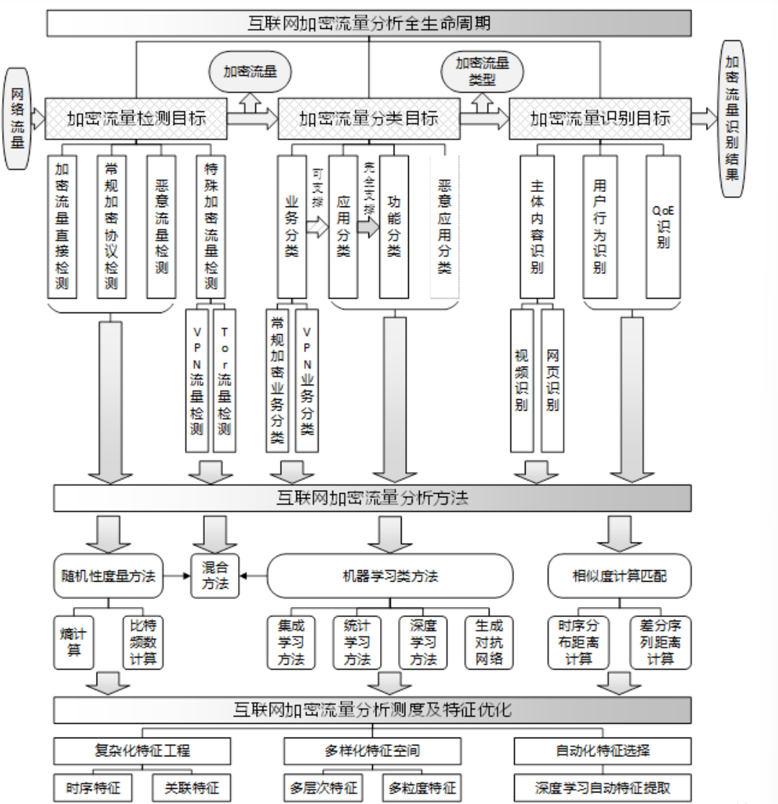

## 加密流量检测研究现状

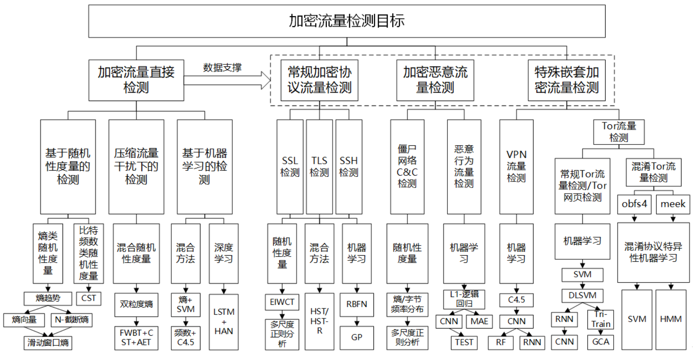

### 加密流量直接检测

- **基于随机性度量的加密流量检测方法**

  选择随机性测度或结合加密流量 特性对随机性测度进行扩展

- **基于随机性度量的压缩流量干扰下的加密流量检测方法**

  实际的数据处理过程中，数据的压缩和加密都会导致源数据的信息熵的增加

  不考虑互联网压缩流量的存在直接检测，则结果有可能受到高熵压缩流量的干扰

- **基于机器学习的加密流量检测方法 & 混合方法**

### 常规加密协议检测

常规加密协议均为写入RFC标准的、具有已知协议头部特征的公开协议

随着可变端口技术的发展和高速网流量抽样化技术的应用，对 SSH、SSL 和 TLS 等常规加密通信协议的非 DPI 识别十分重要

### 加密恶意流量检测

恶意行为产生的流量有的采用特殊的私有网络通信协议，有的则使用公开加密协议掩盖自身行为

### 特殊加密流量检测

VPN 作为有效保护用户隐私和安全的**远程加密隧道访问**技术，已广泛的应用于互联网远程访问中

作为特殊的加密网络流量形式，VPN 和 Tor 流量都存在**嵌套加密**的特性

- **VPN 流量检测**

  VPN 作为特殊加密流量，其将原本多条流打包在同一个加密隧道中，使其流量特征与常规加密流量间存在一定差异

  主要通过机器学习方法和 ISCX VPN-nonVPN 数据集实现

- **Tor 流量检测**

  Tor 流量相较于 VPN 流量具有多层嵌套报文加密的特性

  Tor 融合了**流量混淆技术**、**随机填充**、**时间序列的随机化**，使得难以从大量流量区分

  **机器学习方法**已经被广泛应用于 Tor检测领域

## 加密流量分类研究现状

加密流量业务分类、加密流量应用分类、面向复杂加密应用的功能分类、恶意加密应用分

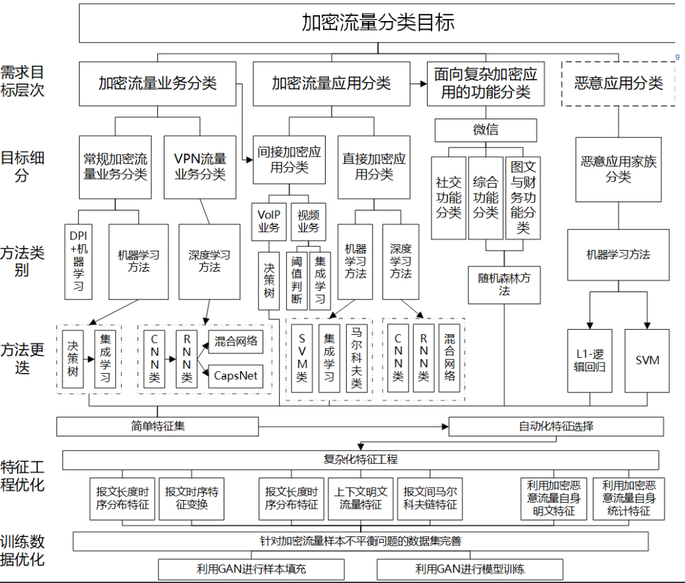

### 加密流量业务分类

业务指的是与用户行为相关的、具有明确领域性的、 人为划分的、正交的、粗粒度的应用集合

### 加密流量应用分类

应用指是隶属于某一业务、以机构组织或企业或个人为提供者、能够独立满足用户需求的软件实体，应用与业务之间构成多对一关系，且应用必须属于某个业务

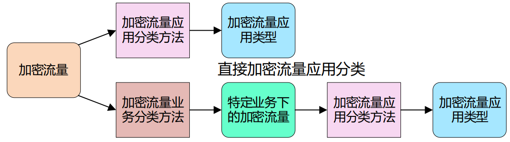

### 加密恶意应用分类

1. 利用加密恶意流量的**自身明文特征差异性**进行分类
2. 利用加密恶意流量自身的**统计特征差异性**进行分类

## 加密流量识别研究现状

加密流量主体内容识别、加密流量用户行为识别、加密流量 QoE 识别

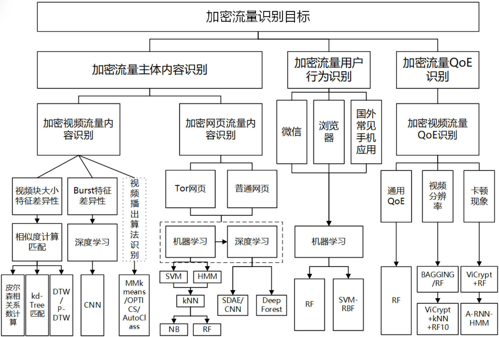

## 未来研究方向展望

- 加密流量样本分布不平衡
- 新型加密协议或应用协议的加密流量
- 基于应用层特征的加密流量 应用分类
- 高速网络加密流量内容识别

# 加密流量精细化分析方法

## 自动化加密流量标签

### A3C 系统

- 在网络终端自动的对流量以应用为粒度**采集、样本构建和样本关联**，并对采集的样本进行**加密流量检测**和**应用类型交叉验证**
- 能获取**高置信度**、**纯净**的加密应用流量**样本数据集**，为加密流量精细化分析提供**可持续的数据集**
- 目前A3C系统已经实现在**Windows、Linux、 Android**三种操作系统平台下的端系统进行样本采集与标签

### 基于“PID-端口”的流量样本构建

- 对端系统产生的网络流量进行采集与样本构建， 就是将应用的流量和**进程**本身相关联。 
- 进程号 **PID** 在单位时间内通过**端口号**来独立标识自己的应用流量，将 PID 和网络流端口关联
- **基于“应用-主进程”映射库**从而进一步构建“应用(业务/功能)-进程-PID-端口-流量”关系链，实现样本的初步构建工作

### 多进程网络应用的流量样本关联

- **一个网络应用可能会包含多个进程**，应用流量关系链只能得到一个进程的流量样本而非整个应用的流量样本
- 进程通过 open、fork 等系统调用，应用进程之间存在**循序执行**的关系
- 获取父进程 ID、进程组 ID，扩充**“应用-主进程”映射库**，实现多进程网络应用内多个进程之间的关联

## VPN 加密流量检测

### Vmess 检测

- V2Ray 工具使用私有协议 VMess 实现数据的随机化加密
- VMess 协议是一种**基于 TCP 协议的无状态协议**，协议本身没有握手过程
- 普通的加密流量在传播过程中包含协议握手和数据传输两个过程
- **VMess 协议下VPN加密流量呈现高度均匀随机分布**，绕 VPN 流量的信息熵分布特性

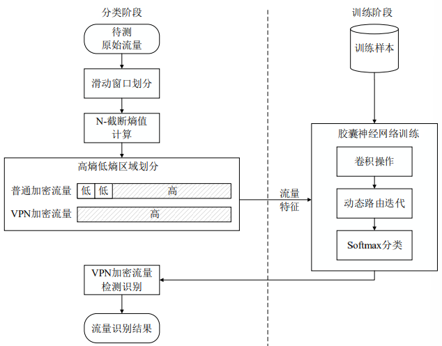

**Vmess 检测方法**

- 基于分段熵分布的 VPN 加密流量检测与识别方法
- 滑动窗口方法对 VPN 加密报文序列高熵、低熵区域进行划分
- 使用胶囊神经网络模型实现 VPN 加密流 量的精准检测与识别

## HTTPS 网页内容识别

## 加密视频内容精准识别

### 传输模式识别

1. 把视频分割成较小的片段
2. 将不同的视频片段从高质量到低质量编码
3. 每个片段通过 HTTP URL 寻址
4. HTTP 缓存服务器内容分发
5. 终端动态选择最优的视频流播放

**识别特征**

- ACK 分段
- SYN - ACK 间隔
- TLS 协议版本
- TLS 指纹数据包总大小

### 加密视频流量 QoE 参数识别方法

- 加密 YouTube 流量识别模块根据 ClientHello 包中“ googlevideo ”字段预先建立的视频服务器 IP 白名单过滤出加密 YouTube 流量
- 传输模式识别模块根据视频流前几个包的特征识别出 YouTube 流量的传输模式
- QoE 参数识别模块根据视频块特征分别对 HLS 和 DASH 模式建立码率和清晰度识别模型
- 视频 QoE 评估模块根据 QoE 参数及视频流量传输参数计算 KPIs 和 vMOS 分数

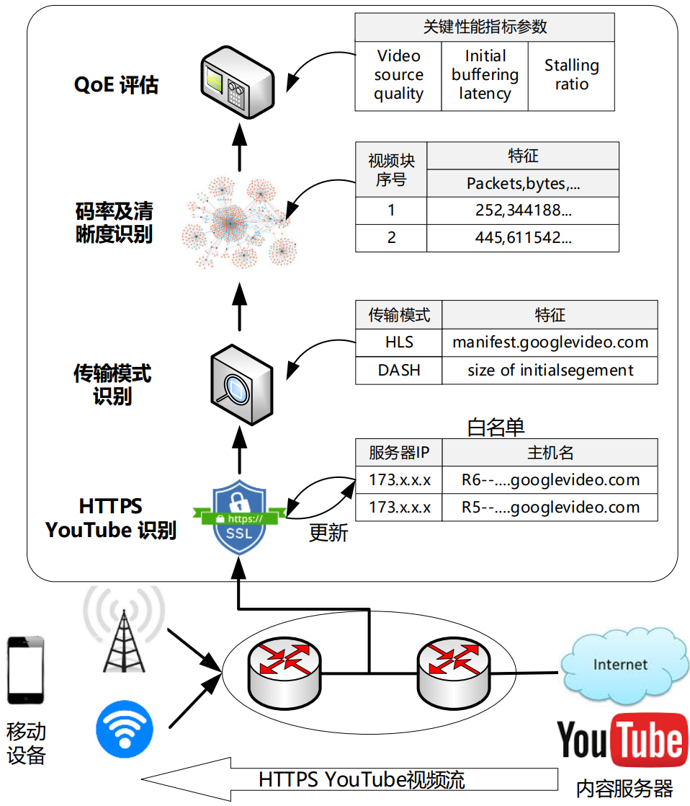

- **视频块特征提取模块**统计视频块网络层信息，无需解析数据包应用层信息
- **模型训练模块**分别选取码率识别和清晰度识别特征子集并建立相应的识别模型
- **分类模块**根据建立的模型识别出视频块的码率和清晰度

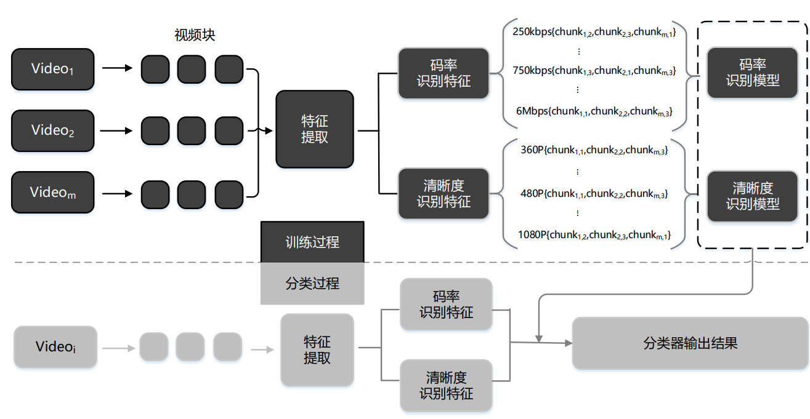

###  加密视频识别

- 分别利用 tcpdump 和 Fiddler 抓取视频密文和明文数据
- 利用 DASH 传输视频的特点，从密文数据最大程度还原加密视频片段大小，并根据视频片段的大小构建视频指纹
- 使用抓取的明文数据构建视频明文指纹库
- 利用序列匹配算法将待匹配的加密视频指纹与指纹库中的指纹进行匹配，最终确定出待匹配加密视频的身份

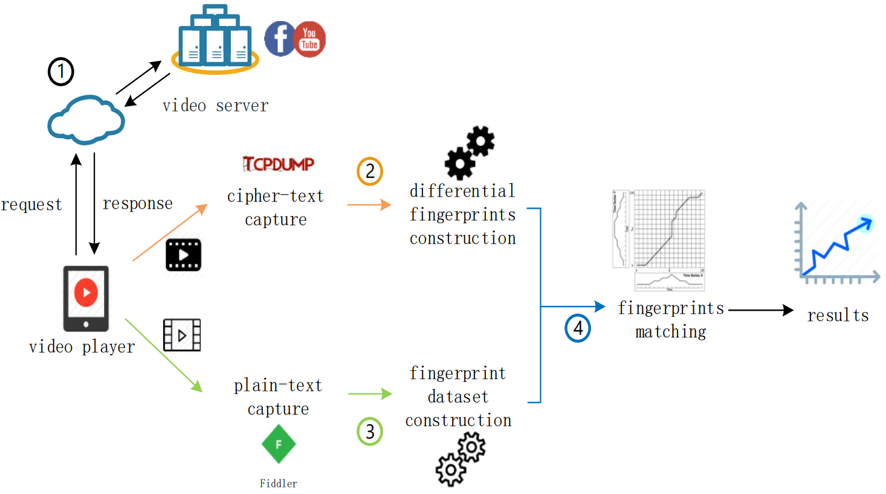

- **加密视频指纹提取模块**利用加密视频片段构建准确的加密视频指纹
- **指纹库构建模块**利用视频明文数据构建明文指纹库
- **识别模块**利用序列匹配算法识别出加密视频指纹所代表的视频标题

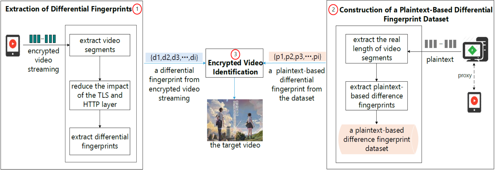

## 上下文关联方法

### SSL/TLS 加密应用分类

**架构**

- **流量预处理模块：**捕获 SSL/TLS 数据包，将同一个会话的数据包组流，然后获取流特征，为构建分类模型做准备
- **学习过程模块：**基于 SSL/TLS 流特征建立集成分类模型，二阶 Markov 链和 HMM 模型分别建立在 SSL/TLS 协议交互的握手过程和数据传输过程，然后构建加权集成分类器
- **分类模块：**基于构建的加权集合分类器识别新到的 SSL/TLS 加密流量

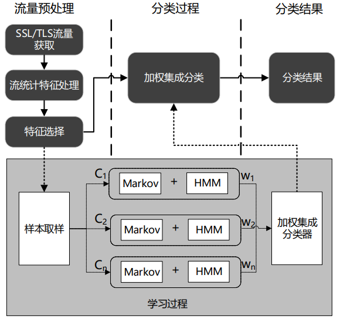

**对加密网络流量进行分类，并推断用户在台式机或笔记本电脑上使用的操作系统，浏览器和应用**

- 使用会话<协议，IP源，IP目的地，端口源，端口目的地>表示，标签是元组<OS, 浏览器, 应用> 
- 数据集 使用 Selenium Web 自动化工具开发收集数据集的爬虫。 收集通过 443 端口( TLS/SSL )的所有流量。最后，使用 SplitCap 将流量分成会话
- 对于 YouTube 和 Facebook 流量，在多个操作系统和浏览器及其 组合的互联网连接上使用爬虫
- 选择径向基函数（RBF）作为核函数的支持向量机（SVM）

### 基于 DNS 的加密流量应用识别

**DNS 加密流关联算法**

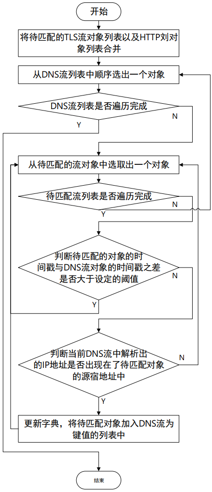

**识别的整体流程**

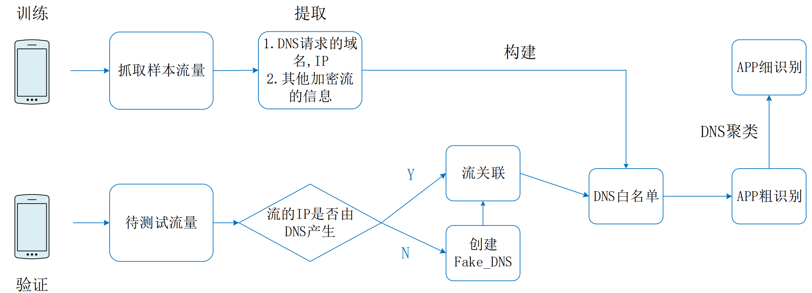

**DNS 白名单建立方法**

1. 从应用的样本流量中解析出 DNS 请求的信息包括所有`cname`和`A_name`以及对应的相应 IP
2. 如果不同 DNS 的 A_name 相同, 合并 2 条 DNS 。如果 2 条 DNS 所属的样本流量来自不同的应用，则将 DNS 标记增加一个可能应用
3. 重复1,2直到读取完所有样本流量

## 单流随机性检测

**可识别（低熵）内容提取方法**

1. 利用固定大小的滑动窗口检测报文流中随机性低（低熵）的分块，基于 **N-truncated Entropy** 测度判断每个分块是否 低于随机性的期望值
2. 在检测出的低熵分块中，基于**累加和检验测度**和**近似熵测度**，利用细粒度的滑动窗口机制对低熵字段划分并提取