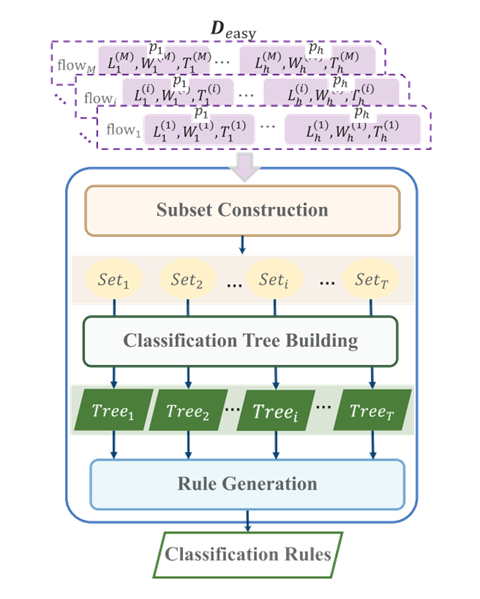

使用早期分类加密流量方法TaTic，减少观察待分类加密流量时间且保证准确性。简而言之，先使用简单的方法准确分类出简单流量，之后阶段再对复杂流量进行分类。

<!--more-->

[toc]

# 简介

## 背景 & 动机

**网络流量分类：**把网络流量与应用协议或产生它的应用程序联系起来

**重要性：**对于网络安全来说，流量分类往往是过滤正常网络流量和发现网络异常的第一步

**面对问题：**

- 网络流量持续增长，需要**快速准确**的分类
- 对于使用越来越多的加密流量，很难兼容速度和准确

## 现有技术局限性

**加密网络流量分类的工作分类：**

- 基于流量统计

  使用整个双向流量提取摘要统计数据包数量、流量持续时间进行分类

  限制：需要观察所有数据包，不适用于加密流量早期分类

- 基于流量序列

  识别数据包状态序列或消息状态序列进行分类

  限制：对于待分类流量需观察流量中相同数量的数据包，若数量过小不能准确区分，若过大则有很大时间开销

## 本文方法

1. 用前几个数据包快速确定是容易流量还是硬流量

   若是容易流量，则直接分类

2. 使用更多的数据包来进行流量分类

**TaTic 模块：**训练模块、分类模块

- 训练模块：利用标记的流量建立两个流量分类模型
  1. 简易流量建模阶段
  2. 硬流量建模阶段
- 分类模块
  1. 简易流量分类阶段
  2. 硬流量分类阶段

## 论文贡献

1. 提出了 TaTic,获得较少平均等待时间又保证分类精度
2. 提出方法快速分辨“易流量”和“难流量”
3. 和现有分类方法进行比较

# 前人综述

## 基于机器学习方法

## 基于深度学习方法

# TaTic 训练模块

基于树的机器学习方法用于分类“易流量”和“难流量”，深度学习网络用于“难流量”

## 简易流量建模

**目的：**每个标记的流量的前几个数据包建立一个易流分类模型

**步骤：**

1. 短序列预处理
2. 短序列训练器

### 短序列预处理

1. 截取流量 $flow_i$ 的前 $h$ 数据包 $[p_1^i,\cdots,p_j^i,\cdots,p_{h}^i]$

2. 若数据包少于 $h$，则将 $h-N_i$ 空包附加到 $flow_i$ 后

3. 从每个数据包中提取 3 个特征：

   - **载荷长度：**$L^i_j$

   - **TCP 窗口大小：**$W^i_j$

   - **时间戳：**$t^i_j$

     时间戳不可直接使用，要转换为其与前一个数据包的间隔时间$T^i_j$实践中时间间隔呈梯形函数
$$
T^i_j=
\left\\{\begin{matrix}
 \lfloor t_j^i \times 100 \rfloor +1 & 0s\le t^i_j<0.1s\\\\
 \lfloor t_j^i \times 200 \rfloor +1 & 0.1s\le t^i_j<1s\\\\
 \lfloor t_j^i \times 1000 \rfloor +1 & 1s\le t^i_j\\\\
\end{matrix}\right.
$$
4. 得到分类特征向量$x'_i=[L^i_j,\ W^i_j,\ T^i_j]$

5. 假设有 $M$ 个训练流，将得到训练样本集 $D_{easy}=\left\{\left(x'_i,y'_i\right)\right\}^M_{i=1}$

   其中，$y'_i$ 表示 $flow_i$ 对应应用标签

4. 送入短序训练器

### 短序列训练器

**目的：**将$D_{easy}$中的所有流量分为易流和难流，并直接输出其易流的类别

**算法：**基于树的机器学习算法

**组成：**

- 子集构建（Subset Construction）
- 分类树构建（Classification Tree Building）
- 规则生成（Rule Generation）

**子集构建（Subset Construction）：**

- 目的：对 $D_{easy}$ 进行多次随机抽样，形成几个不同的训练子集

- 优点：避免单一训练集构建造成过拟合

- 操作：

  1. 从 $D_{easy}$ 中抽取 $M'=\alpha\times M$ 样本，组成集合$Set_i$

     其中，$\alpha$ 为抽样率，遵循 "632+Bootstrap "方法，$\alpha=0.632$

  2. 重复上述操作 $T$ 次，得到新集合 $D'_{easy}=\{Set_1, \cdots , Set_i,\cdots, Set_T \}$

**分类树构建（Classification Tree Building）：**

- 目的：使用 $D'_{easy}$构建多个分类树模型每个分类树用来区分一个流量为易流还是难流
- 操作：为 $Set_i$ 建立分类树 $Tree_i$

**规则生成（Rule Generation）：**

- 目的：对于 $Tree_i$, 选择一些关键叶子节点类别，生成一个由多个规则组成的分类规则集
- 步骤：
  1. 对于 $Tree_i$，选择只包含一个应用类别的叶子节点
  2. 叶子节点可通过节点纯度基尼、熵评估
  3. 对于纯度为 $0$ 的叶子如3、6、8生成分类规则，标签为叶子节点样本标签
  4. 上述节点组成规则集 $Ruleset_i$

## 难流建模阶段

**目的：**流中使用相对较多的数据包并构建这些数据包之间的时间关系来实现对难流量的准确分类

**使用有效载荷长度作为其特征：**

- 有效载荷长度序列反映一个应用流的状态转换关系，适合准确描述每个流
- 窗口大小对于一个方向不同数据包数值一般相同，多在易流量阶段作出分类，因此本阶段不必考虑
- 间隔时间受网络环境的影响较大，时序关系一般没有很强区分度

**步骤：**

1. 长序列预处理
2. 长序列训练器

### 长序列预处理

1. 保留流 $flow_i$ 前 $H$ 个数据包，提取有效载荷长度信息
2. 按照流量数据包顺序排列为有效载荷长度 $x''_i=\left[L^i_j\right]$
3. 对于 $M$ 个标记的训练流，得到训练数据集 $ D_{hard} = ( ( x''_i$, $y''_i ))^M_{i=1}$ 
4. 将 $D_{hard}$ 送入长序列训练器

### 长序列训练器

**算法：**HFC 模型，同时考虑了计算效率和计算效果

**一热编码层：**

- **目的：**将每个有效载荷长度的分类意义与它的数字值分开，转换为离散向量，使神经网络更容易训练

- **步骤：**

  将 $x''_{i}=[L_j^i]$ 转换为稀疏矩阵 $\mathbf{o^i}$ 

  $\mathbf{o^i}=[o_1^i,o_2^i,\cdots,o^i_j,\cdots,o^i_H],\ \ \mathbf{o^i}\in R^{H\times d}$

  其中 $o^i_j$ 对应于 $x''_i$ 的第 $j$ 个有效载荷长度 $L^i_j$，它是一个 $d$ 维向量（$d$ 即最大有效载荷长度）

  具体来说，$o^i_j = [0, 0, \cdots , 1, \cdots , 0]$，其中$L^i_j$的值的维度为 "$1$"，其他维度为 "$0$"

**二维卷积层：**

- **目的：**为一热编码层的输入张量建立多个特征图

- **步骤：**

  1. 将 $C_0$ "过滤器"分别乘以其输入

     其中每个过滤器是一个大小为 $(1, d)$ 的参数矩阵

     $1\times d$ 卷积操作有助于将一热编码所得张量大小恢复到原始输入$H \times 1$

  2. 同时构建 $ C_0$ 个不同的特征图

  3. 对于输入 $ x''_i$，该层的输出用 $X_i\in R^{C_0\times H}$ 表示

**时间卷积网络（TCN）：**

- **目的：**在一个长的数据序列中建立元素之间的关系，提取有代表性的分类特征

- **组成：**由 $L$ 个残差块组成

  - 膨胀卷积层
  - 权重正则层
  - 裁剪层
  - $ReLU$ 层
  - $DropOut$ 层

  

- **膨胀卷积层：**核心功能层

  - 扩张率：超参数，定义处理特征图时在内核参数之间添加的零空间
  - 优点：在不引入新的可训练参数的情况下增加接收场

- **参数**
  
  - 卷积核大小：$K$
  - 扩张率：$2(r-1)$
  
- **输入：**

  - 第 $1$ 个残差块的输入为二维卷积层的输出
  - 第 $r$ 个残差块输入为 $r-1$ 输出

- **输出：**

  使用裁剪层保留膨胀卷积操作后得到的数据的前 $H$ 维

  最后 $2$ 个状态送入分类层

**分类层：**

- 组成：$2$ 个全连接层

- 每层的输出神经元数量：$64$ 和 $R$
- 最后一全连接层激活函数：softmax 

# Tatic 分类模块

1. 简单流量分类阶段：使用在易流建模阶段产生的易流分类模型来确定该流量是易流还是硬流
2. 对于在易流分类阶段可以分类的流量，这个易流分类阶段将直接输出其应用标签
3. 否则，硬流分类阶段对前一阶段未分类的流量进行处理并分配标签

# 实验

## 数据集

1. *TLS应用追踪：*
2. 

## 评价指标

## 易流量参数选择

## 难流量参数选择

## 