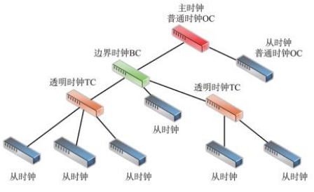
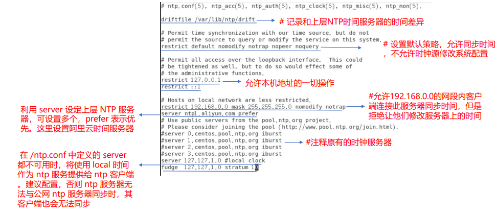
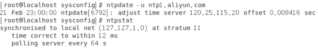
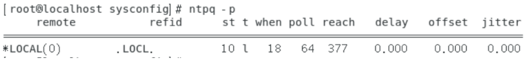
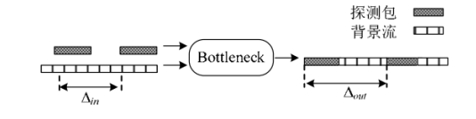
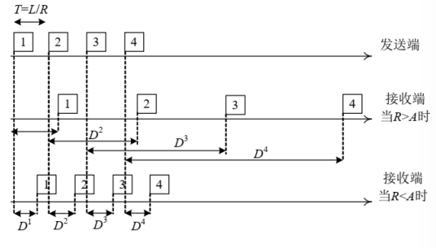
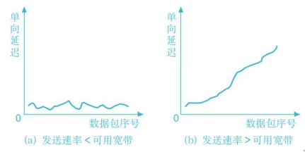
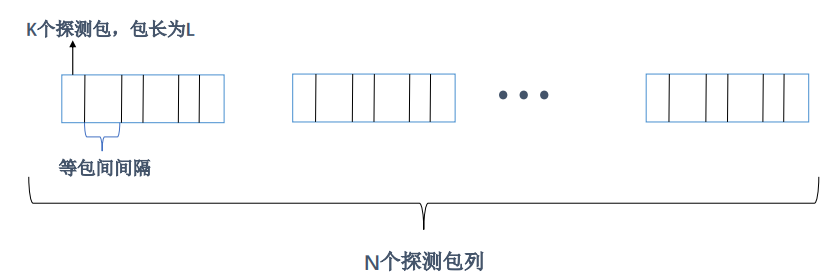
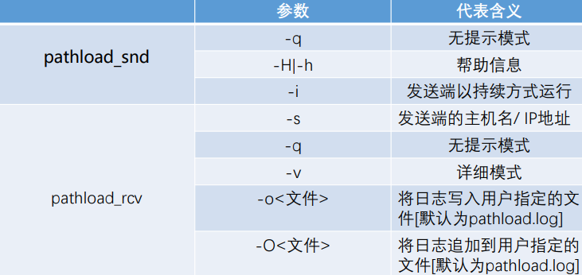
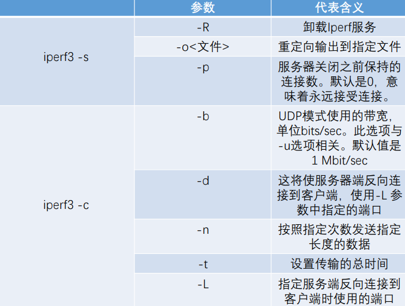

<!--more-->

# 时延测量方法

## 时延测量研究现状

- **往返时延**的测量简单易行：开始与结束时间都由测量发起端时钟记录
- **单向时延**更能准确的评估网络的质量<sub>如视频点播服务，视频数据流通常是在服务器端到客户端的方向上传输</sub>
- 可用 $RTT$ 估算出单向时延，但由于**网络的不对称性**，计算出的单向延时误差很大

## 时延测量的意义

- 时延反映数据包在传输过程中**排队拥塞**的情况
- 有利于对时延敏感的**高实时性**交互应用
- 根据时延来安排可用带宽，提高**带宽利用率**
- 事先检测出**网络安全**问题：对网络流量进行数据分析和数据挖掘，能够发现各种网络攻击，如 DDoS 攻击

## 时延测量问题

- 时钟频差与时钟偏差的相互作用问题
- 非对称路径下时延测量问题
- 计时精度对测量的影响
- 动态路由问题
- 测量负载问题
- 最小时延测量问题

### 时延测量方法

- **基于 ICMP 协议的时延测量**

  - 将报文封装在 ICMP 报文中测量
  - ICMP 报文是 DOS 攻击主要方式，因此很可能被阻塞导致结果不可靠
  - 经典 ICMP 协议测量方法是 ping 和 traceroute

- **基于 UDP 协议的网络时延测量**

  - 接收方从指定传输端口收到 UDP 报文后，反馈报文可能为 UDP 报文或是
    ICMP 报文
  - 当端口对应服务不存在时，反馈的是 ICMP 端口不可达报文
  - 由于没有拥塞控制，UDP 报文使用高峰时为减少对 TCP 流影响，速率会受限

- 基于 TCP 协议的网络时延测量

  -  主要针对ICMP、UDP这两种报文被路由器或防火墙过滤的情况，应用最广
  - TCP 测量难点：TCP 协议设置有发送缓冲窗口，探测数 据包并不是即时发送
  - 发送方记录发送时间远远早于时间发送时间，而使得时延测量的结果大于实际值的现象

  |            | ICMP 报文 | UDP 报文 | TCP 报文 |
  | ---------- | --------- | -------- | -------- |
  | 实现难度   | 容易      | 容易     | 难       |
  | 过滤难度   | 容易      | 容易     | 不容易   |
  | 测量效率   | 高        | 高       | 低       |
  | 安全性     | 低        | 中       | 高       |
  | 测量准确度 | 高        | 较高     | 较高     |

## 时延测量工具

| 名称             | 概述                                                         | 下载                              |
| ---------------- | ------------------------------------------------------------ | --------------------------------- |
| Network Pinger   | 提供时延 ping 操作、trace 跟踪、端口扫描等                   | http://www.networkpinger.com/en/  |
| qperf            | 网络性能测试工具，测量两个节点之间的带宽和延迟，可以通过 TCP/IP 以及 RDMA 传输进行工作 | https://pkgs.org/download/qperf   |
| Ethr             | 一款TCP、UDP和HTTP网络性能测量工具，用于跨多种协议对带宽、连接、数据包、延迟、丢失进行全面的网络性能测量 | https://github.com/Microsoft/Ethr |
| Angry IP Scanner | 非常快速的IP地址和端口扫描仪， 对每个IP地址执行ping操作，以检查其是否存在，然后可以选择解析其主名，确定MAC地址，扫描端口等 | https://angryip.org/download/     |

# 时钟同步方法

**时钟偏差：**某一时刻时钟时间与参考时间之间的误差

**时钟频率：**时钟时间变化的快慢程度

**时钟频差：**时钟的频率与参考时钟频率之间的差值

## 消除时钟偏差主流方法

- **全球定位系统 GPS **
  - 通过卫星授时
  - 使用外置天线来接收信号，测量精度最高，为纳秒级
  - 造价高而且使用环境易受限制，很难被大规模使用
- **网络时间协议 NTP**
  - 发送一个类似 PING 的探测包，接收端在收到探测包后返回一个应答包
  - 探测包的发送时间戳和接收时间戳、应答包的发送时间戳接收时间戳
  - 根据这几个时间戳，NTP 计算出两台机器的时钟偏差，从而完成同步
- **精密时钟同步协议 PTP**
  - 几台机器使用 GPS 作为主时钟，并且为众多节点提供时钟同步
  - 主时钟周期性地发布时间同步协议及时间信息，据此计算出主从线路时延及主从时间差，使主从设备时间保持一致来消除时钟偏差

## PTP 协议

**普通时钟 OC**：一般意义上的时钟，只有一个用于 PTP 同步的端口，可作为主时钟源或从时钟

**边界时钟 BC**：有多个用于精准同步的端口，可以对系统进行简化分解 ， 降低拓扑结构难度

**透明时钟 TC**：对边界时钟进行了优化， 减少级联间的时间延迟累积



### **PTP 协议同步原理**

1. 主时钟周期性向从时钟发送 **Sync 同步报文**，发送时刻 $t_1$ 与 **Follow_UP 跟随报文**发送给从时钟

2. 从时钟收到 **Sync 同步报文**后， 记录到达时刻为 $ t_2$

3. 从时钟解析 Sync同步报文 中的 $t_1$，向主时钟发送 **Delay_Req 延时请求报文**，记录发出时刻 $t_3$ 

4. 主时钟收到 **Delay_Req 延时请求报文** 记录到达时刻 $t_4$，将时间戳 $t_4$ 打包 **Delay_Req 延时请求应答报文**发送给从时钟


主从时钟之间的时钟偏差 Offset，主时钟到从时钟的传输时延：

$Delay = t_2-t_1-Offset\ \ Delay = t_4-t_3+Offset$
$$
Offset=\dfrac{\left(t_2-t_1\right)-\left(t_4-t_3\right)}2
$$

## 时钟频差测量方法

| 算法名称          | 算法概述                                                     |
| ----------------- | ------------------------------------------------------------ |
| **Paxson's 方法** | 基于双向消息通信机制，该方法考虑了网络拥塞的影响，首先对测量结果分段，选择每段中单向延时最小的值，然后使用线性规划算法计算时钟偏差，网络拥塞严重时，该方法的计算精度降低 |
| **Moon 方法**     | 基于单向消息通信机制，发送端以固定的时间向接收端发送一次数据包，并记下发送时间和接收时间。由此得到一组由二维坐标点组成的集合，用一种新的线性方法得到一条逼近测量集合的直线，从而获得时钟偏差 |
| **Li Zhang 方法** | 在 Moon 方法的基础上提出了基于凸包法求解网络单向延时的方法。通过凸包方法检测出逼近各个延迟值的直线从而求解网络单向延时 |

## 时钟同步服务器

- [NTP Pool Project](https://www.ntppool.org/zh/)
- [中国NTP](cn.pool.ntp.org)
- [清华大学](https://tuna.moe/help/ntp/)
- [微软自带](time.windows.com)

## 建立 Linux 时钟同步服务器

1. 检查是否安装 ntp 和 ntpdate

```shell
rpm –qa | grep ntp
```

2. 修改 ntp 配置文件

```shell
vi /etc/ntp.conf
```


3. 启动 ntp 服务，并设置开机自启动

```shell
systemctl start ntpd
 systemctl enable ntpd
```

4. 向设置的 NTP 服务器同步本地主机的时间，并查看同步状态

```shell
ntpdate -u ntp1.aliyun.com 
ntpstat
```


5. 使用 crontab 定时同步，添加定时任务
```shell
systemctl start crond
systemctl enable crond
crontab -e #添加定时任务
0 */2 * * * ntpdate ntp1.aliyun.com && hwclock -w #该命令在新建的crontab文件中添加，2个小时同步一次
crontab –l #查看定时任务
```
6. 查看ntp服务器与上层ntp的状态
```shell
ntpq -p
```


- remote：本机和上层ntp的ip或主机名 
- refid：参考上一层ntp主机地址
- st：stratum阶层 
- when：多少秒前曾经同步过时间
- poll：下次更新在多少秒后 
- reach：向上层ntp服务器要求更新的次数
- delay：网络延迟 
- offset：时间补偿
- jitter：系统时间与bios时间差


# 丢包测量方法

**丢包率：**一段时间内，终端未成功接收的报文总数占源端发送报文总数的比例

**通信双方观测到丢包率：**通常情况下，丢失的数据包的数量非可以直接统计的量，因此引入终端接收的数据包的量$N_{rec}$，则丢包率：$R=1-\dfrac{N_{rec}}{N_{all}}$

**中间结点观测到丢包率：**$N_{rec}$表示实际通过观测结点的数据包的数量，可实际统计；$N_loss$表示在到达观测结点之前丢包总数，可估计：$R=\dfrac{N_{loss}}{N_{loss}+N_{rec}}$

## 丢包测量的问题

- **不参与通信的丢包测量**
  - 对于网络服务提供商而言，从不参与通信的中间结点测量丢包十分困难
- **UDP 协议的丢包测量**
  - UDP 协议简单，不易测量
  - 随着 QUIC 标准化，UDP 传输变多
- **丢包测量开销**
  - 许多测量基于扫描整条数据流中序号位，统计得到丢失和接收的数据包总量
  - 对于网络测量设备和海量网络数据，急需解决高速且准确测量丢包方法
- **加密协议和子流问题**
  - 数据传输更侧重加密难以检测
  - 多路复用导致一条传输层链接包含多条子流，难以区分检测
- **丢包测量敏感度**
  - 不同应用层服务在传输层表现差异巨大
  - 丢包测量通常要监测一定数据量才能准确测量丢包
  - 在数据量不稳定或数据突发时，难以保证丢包测量敏感度
- **丢包测量精度**
  - 丢包测量目标在于检测每个数据包丢失的时间和空间位置
  - 现实很难有方法检测倒数据包级别

## 主动丢包测量方法

|                | 基于 ICMP 协议           | 基于通信双方                           | 基于自定义探针                                               |
| -------------- | ------------------------ | -------------------------------------- | ------------------------------------------------------------ |
| **实现难度**   | 容易                     | 中等                                   | 难                                                           |
| **测量准确度** | 低                       | 高                                     | 中等                                                         |
| **测量开销**   | 高                       | 低                                     | 高                                                           |
| **安全性考虑** | 低                       | 高                                     | 低                                                           |
| **通用性**     | 高                       | 低                                     | 较高                                                         |
| **优劣**       | 功能有限，适用于粗略测量 | 只适用于通信的参与方使用，有较大局限性 | 实现开销大，针对具体测量需求需要特定 设计和实现；由于需要向网络中注入数据探针，存在造成网络阻塞的可能 |

## 丢包测量工具

| 名称                                      | 概述                                                         | 下载                       |
| ----------------------------------------- | ------------------------------------------------------------ | -------------------------- |
| **VoIP & Network Quality Manager (VNQM)** | Trace packet loss with this well-built, real-time monitoring and alerting tools for wan and VoIP. | https://www.solarwinds.c/  |
| **Network Performance Monitor (NPM)**     | A comprehensive network performance monitoring tool that includes packet loss tests and DFI. | https://www.solarwinds.c/  |
| **PRTG Network Monitor**                  | A sensor-based network monitoring tool for packet loss and other performance insights. | https://www.paessler.co/   |
| **Packet Loss Test**                      | Web-based, simple packet loss monitor if you need a free and quick solution. | https://packetlosstest.co/ |


# 带宽测量方法

**主动测量**：通过向网络发送探测数据包，并根据它们所携带的信息来推测带宽的情况，主动测量将增加网络的负载，对测量结果的准确性也有影响。 

- 优点：
  - 灵活、主动，可根据不同网络使用不同方法
  - 不涉及用户信息，对于用户安全
- 缺点：
  - 会发送大量数据包，对网络产生负担和影响，干扰测量结果

**被动测量**：不向网络发送数据包，而是监听网络中的流量来测量网络的带宽，被动测量不会增加网络的负载，但它部署起来却相对困难，一般需要配有专用设备 或拥有特殊权限，这对于普通用户来说不太容易实现。

- 优点：
  - 不需要发送额外探测数据包
  - 结果可能更准确
- 缺点：
  - 需要中间监测设备参与过程的
  - 实时性不高
  - 不利于隐私保护

## 链路/路径带宽测量

| 技术分类             | 核心思想                                                     | 优点                           | 缺点                                                    | 代表算法                                           |
| -------------------- | ------------------------------------------------------------ | ------------------------------ | ------------------------------------------------------- | -------------------------------------------------- |
| 可变包长技术 （VPS） | 从发送端到路径每跳的最小 RTT 与探测包大小成正比,与链路带宽成反比，通过线性回归技术逐跳地测量路径上每一跳链路的容量 | 发送多组探测包，测量精度高     | 测量时间较长，消耗的带宽也较大；ICMP 回应包可能会被忽略 | Pathchar，pchar，clink，Nettimer 等                |
| 包对技术 （PP）      | 测量假设分组只在瓶颈 路处排队，在之前和之后的链路中都不需要排队， 通过接收端包的大小与时间间隔，求出端到端的带宽 | 实现较为简单，对网络的负载较小 | 受背景流量的影响非常 严重，测量所得带宽值很容易出现误差 | Bprobe， pathrate， CapProbe， nettimer， SigMon等 |

### 包间隔模型

**PGM 算法思想：**自源端向目的端发送测量包，当测量包的速率大于可用带宽时，在瓶颈链路上的探测包就会发生排队现象，测量包之间的间隔就会发生变化。通过研究这种变化，就能得到链路可用带宽值。PGM 算法通常假设窄链路和紧链路为同一链路，且窄链路容量已知。
$$
A=C\times\left(1-\dfrac{\triangle_{out}-\triangle_{in}}{\triangle_{in}}\right)
$$
其中，A 为可用带宽，C 为链路带宽， $\triangle_{𝑜𝑢𝑡}$为输出时间间隔， $\triangle_{𝑖𝑛}$为输入时间间隔



- 优点：
  - PGM 算法单次测量时间较短，注入网络的流量较小，因此通常不会对网络造成较大负载
- 缺点：
  - PGM 通常假设窄链路和紧链路为同一链路，且窄链路容量必须提前获知，但在实际网络中，由于交叉背景流的存在， PGM 模型假设窄链路与紧链路为同一链路的前提条件不能总是成立
  - PGM 算法假设路径上的背景流是基于流体模型的，即背景流速率在测量时间内是恒定的，所以当路径上有突发性背景流时，测量精度无法保障

### 包速率模型

**PRM 算法思想：**

- 当所发送的探测流速率高于实际待测链路可用带宽时，则该探测流的单向时延将表现出一种递增趋势
- 如果发送速率小于可用带宽，则探测流的单向时延呈现相对平稳趋势
- 通过对时延变化趋势的判断，寻找 发送速率和到达速率开始匹配的转折点，将对应探测流的平均速率作为路径可用带宽的测量值 



- 缺点：
  - 其不可避免地会引入较多的测量负载，从而造成路径的短暂拥塞

### Pathload 模型

**负载周期流测量法 SLoPS：**发送端周期性的发送一个探测流，接收端测量单向时延

- 若发送速率 > 可用带宽，探测包会在链路队列积累，单向时延增大
- 若发送速率 < 可用带宽，单向时延呈现出的平稳趋势



通过发送端和接收端的协作，Pathload能交互式调整发送端的速率，使得发送速率 逐步趋向于可用带宽

算法结束条件：测量发送速率收敛于某个区间，所以测量返回的结果是个区间

**探测包序列**

在 pathload 算法执行中发送 N 个探测包列，每个探测包列速率都相同， 每个探测包列都含 K 个等长等间隔的探测包，也可以说这 N 个探测包列是完全相同的探测包列。将以上发送 N 个探测包列的过程称为一轮探测


$$
PCT=\dfrac{\sum_{k=2}^HI\left(D_k-D_{k-1}\right)}{H-1}\\
RDT=\dfrac{D_H-D_1}{\sum_{k=2}^HI\left(D_k-D_{k-1}\right)}
$$
其中，$I(X)=\left\{\matrix{1\ \ if\ X\ is\ true\\0\ \ if\ X\ is\ false}\right.$

- **PCT：**连续的探测包是否呈现递增趋势
  - $0\le PCT\le 1$
  - $PCT>0.66$，算法认为该速率下的探测包列的单向时延为增长的趋势
  - $PCT<0.54$，算法认为探测包列的单向时延为非增的趋势
- **PDT：**序列最后和第一个探测包的单向时延的变化，比探测流内所有相邻探测包的时延变化的绝对值之和
  - $-1\le PCT\le1$
  - $PDT>0.55$，算法认为该速率下探测包列的单项时延为增长的趋势
  - $PDT<0.45$，算法认为该速率下探测包列的单向时延为非增的趋势
  - $0.45<PDT<0.55$，算法认为该速率下探测包列的单向时延的变化趋势不明显

**发送速率调整**

通过二分搜索的方法改变发送探测包的速率，逐步收敛到可用带宽

若$R(n)<A$，则$R_{\min}=R(n)$，$R(n+1)=\dfrac{R_{\max}+R_{\min}}2$

若$R(n)>A$，则$R_{\max}=R(n)$，$R(n+1)=\dfrac{R_{\max}+R_{\min}}2$

### Spruce 方法

Spruce 在测量的准确性和鲁棒性最优

**算法假设前提**

- 窄链路和紧链路为同一链路
- 窄链路容量已知：窄链路指端到端路径中各段链路中容量最小的链路

### Spruce 算法流程

1. 将两个大小相同探测包组成的探测包对注入待测路径中
2. 背景流量的插入使包间间隔增大
3. 根据包对的包间间隔的变化估计可用带宽
4. 发送多个包对来获取可用带宽的平均估测值

其中，$g_{in}$ 和 $g_{out}$ 分别表示在发送端和接收端探测包对中两个包的包间间隔

## 带宽测量工具

https://www.caida.org/tools/taxonomy/performance.xml

### Pathload



### iperf3


