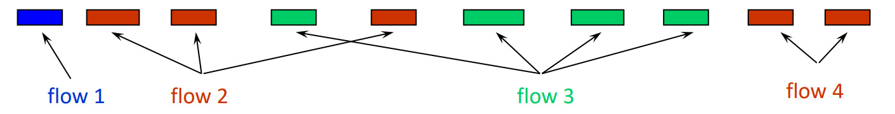
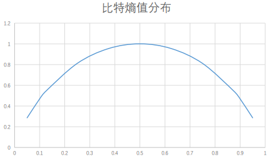
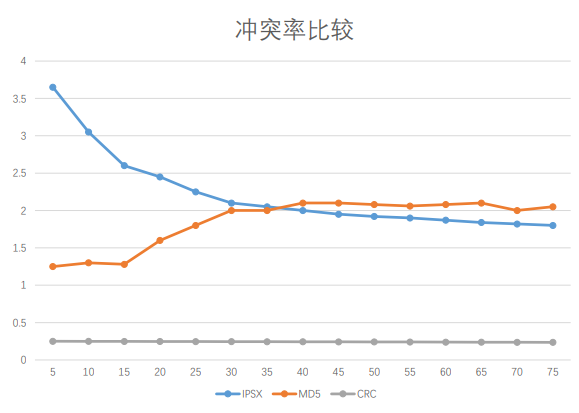
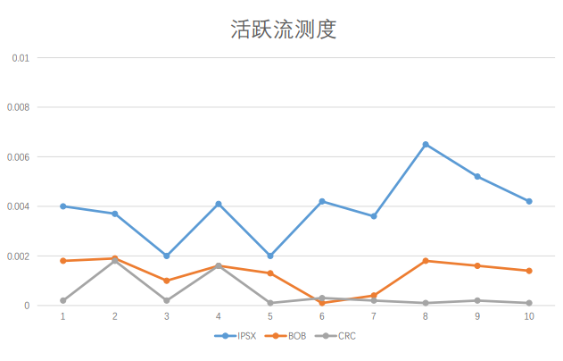
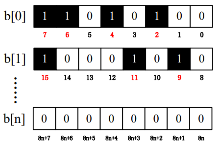
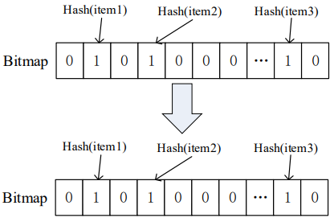
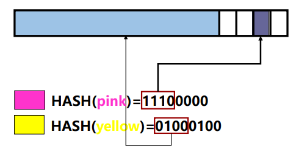
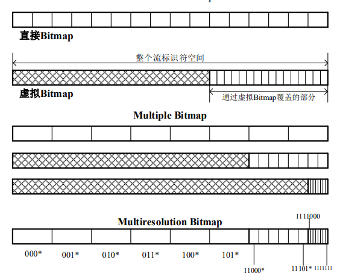
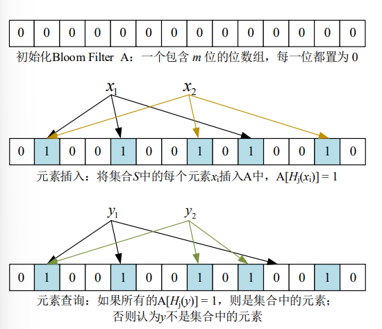
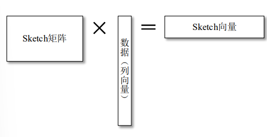

网络带宽已经达到了100Gbps甚至10Tbps，这么大数据量如何处理，主要可以从算法和硬件改进进行研究。

<!--more-->

**算法实现**

- 抽样：只能看到样本部分个体
- 哈希：样本摘要
- 聚类：事先定义好聚类标签<sub>路由器等设备</sub>

# 流量抽样方法

## 大数据特征

1. 数据量庞大，不断递增 
2. 数据当中有重要的特征或趋势 
3. 对于如何更好的搜寻，总结它们，我们没有明确的答案



**数据流**：在一段时间内，有相同或相似标识的数据分组集合 
**数据流标识**：源，目的IP地址，源，目的端口等 
**级别**：每天在大型ISP网络当中，会生成100TB级别的数据流
**数据流记录**： 流键值，分组总数，字节总数，数据流持续时间 
**根据时间跨度管理网络**：负载测试，DDoS攻击检测

## 为什么抽样

1. 资源受限<sub>带宽、内存、CPU</sub>
2. 查询要求<sub>点对点, 精确度, 集成, 速度</sub>
3. 数据特性<sub>重尾性, 相互关联性</sub>

## 独立数据流抽样方法

**伯努利抽样：**每个物体以相同概率$p$被抽样

**泊松抽样：**权重为$x_i$的物体抽样概率为$p_i$

**一致性抽样：**要从不同集合的物体当中抽样，抽样不受权重和出现次数的影响<sub>$f(k)\rightarrow R$</sub>,同一标识同一决策

**基于哈希的抽样(Bottom-k抽样)：**对每个标识生成哈希函数

# 测量流量哈希函数

**定义**：以数据流信息或者分组内容为输入值，来生成摘要的哈希函数 
**是否使用密钥**：保证处理大批量数据的效率，测量哈希函数不使用密 钥 
**输入值特征**：数据分组当中不随时间变化的部分

**五元组定义数据流标识：**$\{源IP, 目的IP, 源端口, 目的端口, 协议\}$

**高速网络四元组定义数据流标识：**$\{源IP, 目的IP, 源端口, 目的端口\}$<sub>高速网络绝大多数数据流都为TCP</sub>

**分类：**

- 直接使用报文字段：效率更高，随机性不好
-  使用哈希函数：效率略低，但是随机性更好

**功能：**

- 本质上概括了分组特征，实现了每个个体的排序和 分类功能
- 排序和分类，为后续抽样，流量统计和流长分布计算提供了 便利

## 哈希函数测试

### 随机度测度

研究一个哈希函数H，其输出为1个16比特的字符串，对于任何一个输入
每一种输出的抽样精度越接近$2^{-16}$，其随机性越好

**位熵值：**数据流可以取0/1，假设$p(0)=p\ \ p(1)=1-p$，则位熵值$H(b)$：
$$
H(b)=-\left(p\log_2p+(1-p)\log_2(1-p)\right)
$$
比特随机测度：$E=\dfrac{H(b)}{H_{\max}(b)}$

当$p=\dfrac12$时，即$p(0)=p(1)$时取最大值



**位流熵值：**对于一个长度为$k$的比特流，一共有$2^k$种排列组合方式，第$i$种排列组合出现的概率为$p_i$，则该位流熵值为：
$$
H(k)=-\sum_{i=0}^{2^k-1}p_i\log_2p_i
$$
位流随机测度：$E=\dfrac{H(k)}{H_{\max}(k)}$，所有排列组合等概率出现取最大值

随机测度取值$0\le E\le 1$，越接近1，随即性能越好

### 计算速度

因素：硬件因素、函数因素

$IPSX<<ROB<<CRC<<MD5$

### 均匀度测试

**均匀性：**所有可能出现的结果都应该尽可能均匀分布，不应该出现某几种输出聚焦的情况

若将哈希函数的输出空间划分为$n$等分，对于$m$个实验对象，落入每一个区间的数量应该为$f_0=\dfrac mn$。假设第$k$个区间数量为$f_k$，则理想偏差：
$$
\chi^2=\dfrac{\sum_{k=1}^n\left(f_k-f_0\right)^2}{f_0}
$$
假设样本均匀数量为512，可信度0.99，则$\chi^2_{0.99}(511)=588.7$。若统计值$>588.7$，则拒绝均匀分布假设。

经过实践：

- MD5和IPSX均匀性不够好
- BOB和CRC具有较好的均匀性

### 冲突率测度

**冲突：**两个不同数据流被映射到同一区域，即对于$f_1\ne f_2$，但是$H(f_1)=H(f_2)$

**冲突次数：**最后函数的输出空间当中第$i$个槽的统计结果为$N_i$，则发生该槽的冲突次数：
$$
C^2_{N_i}=\dfrac{N_i(N_i-1)}2
$$
**冲突率：**计算整个输出空间的冲突次数的总和，求出平均冲突次数来衡量该哈 希函数的冲突率：
$$
C=\dfrac1{\dfrac{N(N-1)}2}\sum_{i=1}^M\dfrac{N_i(N_i-1)}2
$$
其中，$\sum_{k=1}^MN_k=N$



根据实验，CRC冲突率最小，IPSX和MD5接近

### 活跃流测度

**活跃流：**在属于该流的第一个报文分组到达后，在之后的每一个时间间隔里面，都至少有一个属于该数据流的报文分组到达

**活跃流数：**符合活跃流的数据流的总数

**活跃流测度：**可以提供算法完整的一致性刻画
$$
\hat n=m\ln\left(\dfrac m {m-n}\right) \\
f=\dfrac{\left|\hat n-n\right|}n
$$
其中，$f$为活跃流测度，$m$为哈希函数输出空间总槽数，$n$为哈希函数实际映射到的总槽数，$\hat n$为为活跃流数量的最大似然估计值



## 哈希算法

### IPSX(IP Shift and XOR)算法

- 为处理 IPv4 数据包而定制的
- 利用 IP 分组不同字段可变性，使得减少IP分组之间相关性进行处理
- 来自 IPv4 和 TCP/UDP 报头的字段用作输入 
- 只要使用位移和异或的极少数指令

**IPSX 组成**

1. 输入选择：其形式是从IP包的各个部分进行组合输入 

   从 IP 数据包头的前 20 个字节和IP负载的前8个字节中提取

2. 计算组合上的散列

   $f_1\ =\ ip_{src}\ \ f_2\ =\ ip_{dst}\ \ f_3\ =\ port_{src}\ ||\ port_{dst}$

   $v_1\ =\ f_1 \wedge f_2 $

   $v_2\ =\ f_3$

   $h_1\ =\ v_1\ <<\ 8$

   $h_1\ \wedge=\ v_1>>4$

   $h_1\ \wedge= \ v_1\ >>\ 12$

   $h_1\ \wedge=\ v_1\ >>\ 16$

   $h_1\ \wedge=\ v_2\ <<\ 6$

   $h_1\ \wedge=\ v_2\ <<\ 10$

   $h_1\ \wedge=\ v_2\ <<\ 14$

   $h_1\ \wedge=\ v_2\ >>\ 7$

IPSX 哈希函数最后运算生成的结果为 32 比特，取其后 16 位，即输出$h_1$

### 异或位移算法

比 IPSX 同等运算速率，但是随机性更好的

$hash_1\ =\ ip\_src[1]\ <<\ 3,\ \ hash_1\ =\ hash_1\ \wedge\ \ ip\_dst[1],\ \ hash\ =\ hash_1 $

$hash_1\ =\ ip\_src[0]\ <<\ 3,\ \ hash_1\ =\ hash_1\ \wedge\ \ port\_src,\ \ hash\ =\ hash_1 $

$hash_1\ =\ ip\_src[0]\ <<\ 3,\ \ hash_1\ =\ hash_1\ \wedge\ \ port\_dst,\ \ hash\ =\ hash_1 $

# 数据流测量方法

## Bitmap 测量方法

**数据结构**：基于“位”的映射，使用一个bit位来标记某个元素对应的value，key是 元素，通过1为表示一个数，0表示不存在，1表示存在



**Direct Bitmap：**。在 流标识上使用Hash函数，将每个流映射到Bitmap的1个位。在测量间隔开始时，所有位都设置为零。 每当一个包进入时，它的流标识散列到的位被设置为1



**Virtual Bitmap：**仅存储Bitmap的一部分，用采样因子乘以估计值，但当很少有流活动时估计不准确



**Multiresolution Bitmap：**将具有不同分辨率的区域称为 Multiresolution Bitmap 的组成部分合成，在计算时，基于每个组件中设置的比特数，选择其中一个"基"来估计、推断Hash到这个"基"和所有更高分辨率组件的流数量



```shell
# 找到最精确的组件
base = c - 1
while base > 0  and  bitsSet(component[base]) <= set_max
    base = base - 1
end while
base = base + 1
if  base == c  and  bitsSet(component[c]) > set_max
    if  bitsSet(component[c]) == b_last
        return "无法给出估计"
    else
        warning "估计不准确"
    end if
end if
# 估计Hash到它的流的数量
m = 0
for  i = base  to  c - 1
    m = m + b ln(b / bitZero(component[i]))
end for
# 确定并使用比例因子
m = m + b_last ln(b / bitZero(component[c]))
factor = k^{base-1}
return factor * m
```

| bitmap | 流数估计 | 平均标准误差$StdError\left(\dfrac{\hat n}n\right)$ | 内存最小占用量 |
| ------ | ---- | --- | --- |
| Direct bitmap | $\hat{n}=b\ln\left(\dfrac bz\right)$ |$\approx \dfrac{\sqrt{\text e^\rho-\rho-1}}{\rho\cdot\sqrt b}$|$<\dfrac N{\ln\left(N\varepsilon^2+1\right)}$|
| Virtual bitmap | $\hat{n}=\dfrac1\alpha\ln\left(\dfrac bz\right)\\=h\ln\left(\dfrac bz\right)$ |$\approx \dfrac{\sqrt{\text e^\rho-1}}{\rho\cdot\sqrt b}$|$\dfrac{1.5441}{\varepsilon^2}$|
| Multiresolution bitmap |      |$\approx \dfrac{\sqrt{\frac{k-1}k\left(\text e^\rho-1\right)+\text e^{\frac \rho k}-1}}{\rho\sqrt{\frac{bk}{k-1}}}$|$\dfrac{0.9186\ln\left(N\varepsilon^2\right)}{\varepsilon^2+ct}$|

## Bloom Fliter 测量方法

**Bloom Fliter 设计：**用多个 Hash 函数映射，有较高容错性，主要查找是否存在



记 $m$ 位 Bloom Fliter 占用的总内存，$n$ 为综援素个数，$k$ 为 Hash 函数个数，$p$ 为 Bloom Fliter 中一位为 $0$ 的概率，假设 Hash 函数分布均匀，则任意一位为 $0$ 概率：
$$
p'=\left(1-\dfrac1m\right)^{nk}\approx\text e^{-\frac{kn}m}=p
$$
 **误判率：**
$$
f(m,k,n)=\left(1-p'\right)^k\approx\left(1-p\right)^k=\left(1-\text e^{-\frac{kn}m}\right)^k
$$
若给定误判率$f_0$，则 Bloom Fliter 可以最多表示元素个数：
$$
n_0=-\dfrac{\ln\left(1-\text e^{\ln \frac{f_0}k}\right)\cdot m}k
$$
若给定 m=10240bit, n=1000：当 k=7 ，有最小误判率

## Sketch 测量方法

Bloom Fliter 是基于向量，而 Sketch 是基于矩阵



